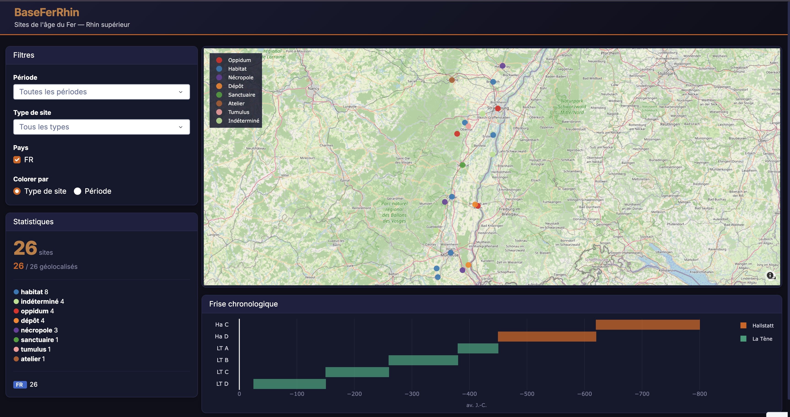
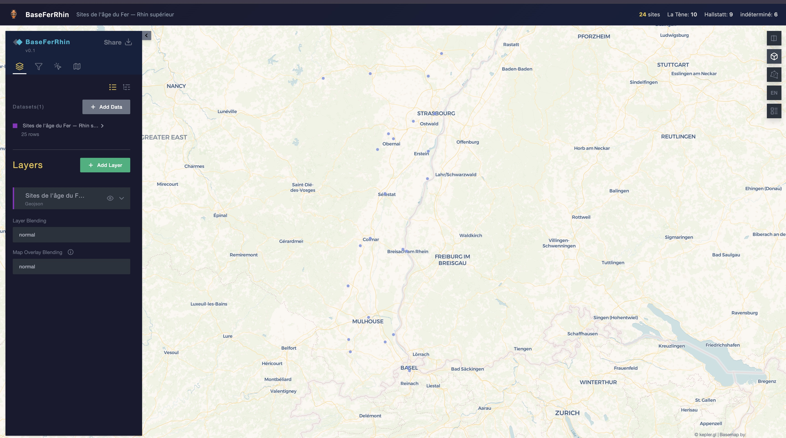
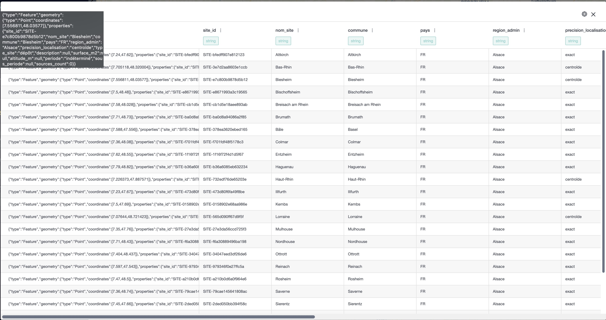

# BaseFerRhin

Inventaire normalisé des sites de l'**âge du Fer** du **Rhin supérieur** — pipeline ETL Python avec extraction OCR Gallica, géocodage multi-fournisseur et interface web interactive. Coordonnées internes en **Lambert-93 (EPSG:2154)**.

### Interface Dash



### Kepler.gl (Node.js / React / DuckDB)





## Périmètre

### Géographique

| Région | Département/Canton | Pays |
|---|---|---|
| Alsace | Bas-Rhin (67), Haut-Rhin (68) | FR |
| Bade-Wurtemberg | Südbaden | DE |
| Canton de Bâle | Bâle-Ville, Bâle-Campagne | CH |

### Chronologique

| Période | Datation | Sous-périodes |
|---|---|---|
| Hallstatt | env. -800 à -450 | Ha C, Ha D1, Ha D2, Ha D3 |
| La Tène | env. -450 à -25 | LT A, LT B1, LT B2, LT C1, LT C2, LT D1, LT D2 |

### Types de sites

Oppidum, habitat, nécropole, dépôt, sanctuaire, atelier, voie, tumulus.

## Sources de données

- **Gallica (BnF)** — Carte Archéologique de la Gaule 67/1 et 68, Cahiers alsaciens d'archéologie, ouvrages (Déchelette)
- **Métadonnées Gallica** — Extraction structurée depuis l'API SRU (communes, types de sites)
- **Fichiers locaux** — CSV, Excel, PDF, rapports de fouilles
- **Golden set** — 20 sites de référence validés manuellement (`data/sources/golden_sites.csv`)

## Installation

```bash
pip install -e ".[dev]"
```

Dépendances optionnelles :

```bash
pip install -e ".[ui]"     # Interface web Dash
pip install -e ".[viz]"    # Visualisation Kepler.gl (Jupyter)
```

Prérequis système pour l'OCR Gallica : `tesseract` avec les packs langue `fra` et `deu`.

## Utilisation

### Pipeline ETL

```bash
python -m src --config config.yaml
```

Le pipeline exécute 8 étapes séquentielles avec checkpoints :

```
DISCOVER → INGEST → EXTRACT → NORMALIZE → DEDUPLICATE → GEOCODE → VALIDATE → EXPORT
```

Reprise depuis une étape :

```bash
python -m src --config config.yaml --start-from NORMALIZE
```

### Interface web

```bash
python -m src.ui
# → http://127.0.0.1:8050
```

Carte interactive, filtres par période/type/pays, frise chronologique et tableau triable.

### Visualisation Kepler.gl

```bash
python .cursor/skills/kepler-gl-archeo/scripts/visualize.py data/output/sites.geojson
```

## Exports

| Format | Fichier | Description |
|---|---|---|
| GeoJSON | `data/output/sites.geojson` | Points EPSG:4326 (reprojection auto depuis L93) |
| CSV | `data/output/sites.csv` | UTF-8 BOM, colonnes `x_l93`/`y_l93` (EPSG:2154) |
| SQLite | `data/output/sites.sqlite` | Tables `sites` (`x_l93`/`y_l93`), `phases`, `sources` |
| DuckDB | `src/keplergl/data/sites.duckdb` | 4 tables + 2 vues (via `build_duckdb.py`) |

## Architecture

```
src/
├── domain/              18 fichiers — modèles Pydantic, normalisation, validation, déduplication
│   ├── models/          Site, PhaseOccupation, Source, RawRecord, 7 enums
│   ├── normalizers/     Type, période, toponymie (FR/DE), composite
│   ├── validators/      Cohérence chronologique et géographique
│   └── deduplication/   Scoring fuzzy, union-find, merge
├── infrastructure/      27 fichiers — extracteurs, géocodage, persistance
│   ├── extractors/      Gallica (SRU, IIIF, OCR, Tesseract, Metadata), CSV, PDF
│   ├── geocoding/       BAN, Nominatim, GeoAdmin, multi-provider, cache
│   └── persistence/     Export CSV, GeoJSON, SQLite, stats
├── application/         5 fichiers — pipeline ETL, config YAML, review queue
├── keplergl/            1 fichier — conversion DuckDB pour Kepler.gl
└── ui/                  9 fichiers — Dash app, carte Plotly, frise, filtres
```

**61 fichiers Python** | **5 modules de test** | **Python ≥ 3.11** | **Hatchling**

## Tests

```bash
pytest
```

| Module | Couverture |
|---|---|
| `test_models.py` | Modèles, contraintes, validateurs Pydantic |
| `test_normalizers.py` | Normalisation type/période/toponymie |
| `test_validators.py` | Cohérence chrono/géo |
| `test_deduplication.py` | Scoring, merge, review queue |
| `test_export.py` | Export CSV, GeoJSON, SQLite |

Golden set : 20 sites de référence (`tests/fixtures/golden_sites.json`).

## Documentation

| Document | Contenu |
|---|---|
| [Architecture](docs/ARCHITECTURE.md) | Clean Architecture, diagrammes de flux, dépendances, arbre des données |
| [Domaine](docs/DOMAIN.md) | Modèles Pydantic, enums, normalisation, validation, déduplication |
| [Pipeline](docs/PIPELINE.md) | 8 étapes ETL, extracteurs Gallica, géocodage, configuration |
| [Interface web](docs/UI.md) | Application Dash, composants, palettes, thème CSS |

## Spécifications

Le dossier `openspec/` contient les spécifications détaillées du pipeline ETL :

| Spécification | Contenu |
|---|---|
| [Modèle de domaine](openspec/changes/base-fer-rhin-etl-pipeline/specs/domain-model/spec.md) | Agrégats Site, Phase, Source |
| [Extracteurs de sources](openspec/changes/base-fer-rhin-etl-pipeline/specs/source-extractors/spec.md) | CSV, PDF, Gallica extractors |
| [Extracteur Gallica](openspec/changes/base-fer-rhin-etl-pipeline/specs/gallica-extractor/spec.md) | SRU, IIIF, OCR, mentions |
| [Pipeline ETL](openspec/changes/base-fer-rhin-etl-pipeline/specs/etl-pipeline/spec.md) | Orchestration 8 étapes |
| [Déduplicateur](openspec/changes/base-fer-rhin-etl-pipeline/specs/site-deduplicator/spec.md) | Scoring, union-find, merge |
| [Normaliseur](openspec/changes/base-fer-rhin-etl-pipeline/specs/site-normalizer/spec.md) | Type, période, toponymie |
| [Multi-géocodeur](openspec/changes/base-fer-rhin-etl-pipeline/specs/multi-geocoder/spec.md) | BAN, Nominatim, GeoAdmin |
| [Export](openspec/changes/base-fer-rhin-etl-pipeline/specs/data-export/spec.md) | CSV, GeoJSON, SQLite |

## Licence

MIT
